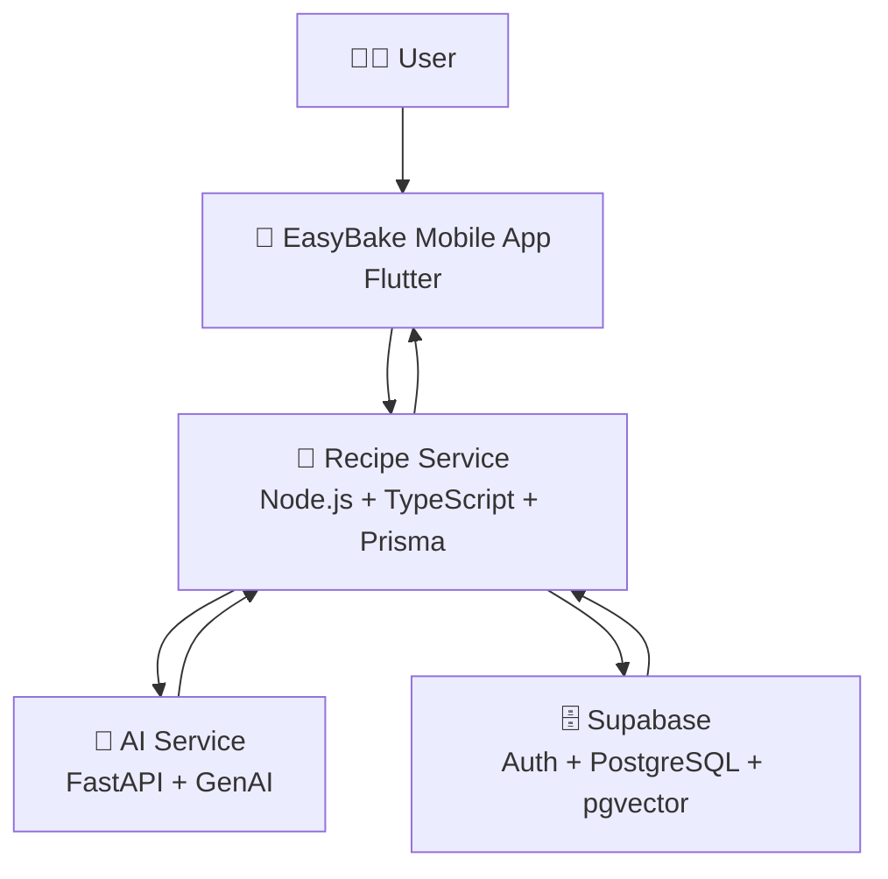

<p align="center">
	
</p>

<p align="center">
	<strong>Cook smarter. Bake better.</strong>
</p>

<p align="center">
	Your smart kitchen companion that transforms cravings and ingredients into practical, delicious recipes in seconds.
</p>

<p align="center">
	
	
	
	
	
</p>

---

## ✨ Why EasyBake?

EasyBake removes the stress from daily cooking by combining:

- 🧠 Intelligent AI assistance for recipe creation and meal guidance.
- 📱 A modern Flutter mobile experience for fast, friendly usage.
- 🧩 Clean microservice architecture for scale and maintainability.
- ⚡ Fast feedback loops for local development with Docker.

## 👨‍🍳 AI Chef Assistant

<p align="center">
	
</p>

Meet **AI Chef Assistant**: your smart kitchen partner designed to make cooking easier, faster, and more creative.

- 🍳 Suggests recipes from the ingredients you already have.
- 🥗 Helps generate healthier alternatives based on your goals.
- 📝 Turns rough meal ideas into structured, step-by-step recipes.
- ⏱️ Adapts suggestions to available time and cooking complexity.

## 🧱 Product Modules

EasyBake is a full-stack platform composed of one mobile app and two backend services:

| Module | Purpose | Stack |
| --- | --- | --- |
| `apps/easy_bake_mobile` | User-facing app experience (Android, iOS, web, desktop) | Flutter, Dart |
| `services/recipe-service` | Recipe orchestration and business API layer | Node.js, TypeScript, Express, Prisma |
| `services/ai-service` | AI generation and assistant intelligence | Python, FastAPI, Google GenAI |
| `Supabase` | User management, relational data, and vector-powered retrieval | Supabase Auth, PostgreSQL, pgvector |

## 🗄️ Supabase Data Layer

EasyBake uses **Supabase** as the core data platform:

- 👤 **Users**: account and authentication flows are managed via Supabase.
- 🗄️ **Relational DB**: structured app data is stored in PostgreSQL tables with relations.
- 🔎 **Vector DB**: embeddings can be stored and queried with `pgvector` for semantic use cases.

## 🏗️ Architecture



### 🔄 Request Flow (High Level)

```text
1) User submits a cooking request in the mobile app.
2) Recipe Service validates and orchestrates the request.
3) AI Service generates structured culinary intelligence.
4) Recipe Service returns clean response data to the app.
5) User receives actionable recipes and guidance.
```

## 🛠️ Tech Stack

- Frontend: Flutter, Dart
- Recipe API: Node.js, Express, TypeScript, Prisma
- AI API: Python, FastAPI, Google GenAI integration
- Data Platform: Supabase Auth, PostgreSQL (relational), pgvector (vector DB)
- DevOps: Docker Compose

## 🚧 Coming Soon

### 💬 EasyBake Community Chat

A shared space where EasyBake users can exchange cooking ideas, discuss techniques, and share favorite recipes.

- 👥 Discover community tips and real kitchen experiences.
- 🍽️ Share recipe variations and get feedback from other users.
- 🤖 Call in the **AI Chef Assistant** directly in conversations for suggestions, substitutions, and quick guidance.

### 📸 Create Recipe from Image with AI

Turn recipe images into a complete, structured recipe with AI support.

- 🖼️ Upload a recipe image (document photo, screenshot, or handwritten note).
- 🧠 Let AI extract ingredients, quantities, and cooking steps from the image.
- 📝 Receive a clean, structured recipe with optional health-aware adjustments.

## 🚀 Quick Start

### 1. Prerequisites

- Docker + Docker Compose
- Flutter SDK
- Node.js (for local service development)
- Python 3.10+ (for local AI service development)

### 2. Run Backend Services (Recommended)

From repository root:

```bash
docker compose up -d --build
```

Or use helper scripts:

- Windows: `scripts/windows/start-services.ps1`
- Linux/macOS: `scripts/linux/start-services.sh`

Stop services:

```bash
docker compose down
```

### 3. Run Mobile App

```bash
cd apps/easy_bake_mobile
flutter pub get
flutter run
```

## 🌐 Service Ports

- AI Service: `http://localhost:8000`
- Recipe Service: `http://localhost:4000`

## 🧪 Development Notes

- Environment variables are loaded from service-level `.env` files.
- `recipe-service` depends on `ai-service` health before startup in Docker.
- The mobile app is designed to consume the backend APIs as the single source of recipe intelligence.

## 📁 Repository Structure

```text
📦 EasyBake
├─ 📄 README.md
├─ 🐳 docker-compose.yml
├─ 📱 apps
│  └─ easy_bake_mobile
│     ├─ lib
│     ├─ assets
│     ├─ android / ios / web
│     └─ pubspec.yaml
├─ 🧠 services
│  ├─ ai-service
│  │  ├─ app
│  │  ├─ tests
│  │  └─ requirements.txt
│  └─ recipe-service
│     ├─ src
│     ├─ prisma
│     └─ package.json
└─ ⚙️ scripts
   ├─ windows
   └─ linux
```

## 🎯 Vision

EasyBake is built to become more than a recipe app.

It is a kitchen companion where AI helps users move from uncertainty to confidence, from ingredients to meals, and from routine cooking to joyful food experiences.

<p align="center">
	<b>EasyBake</b><br/>
	<i>Where smart technology meets everyday cooking.</i><br/>
	<sub>Made with love by Gal Helner 💛 🍞</sub>
</p>
