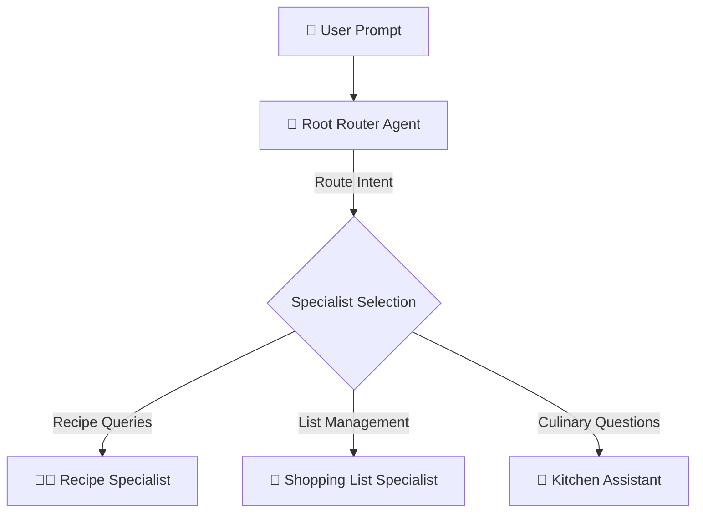
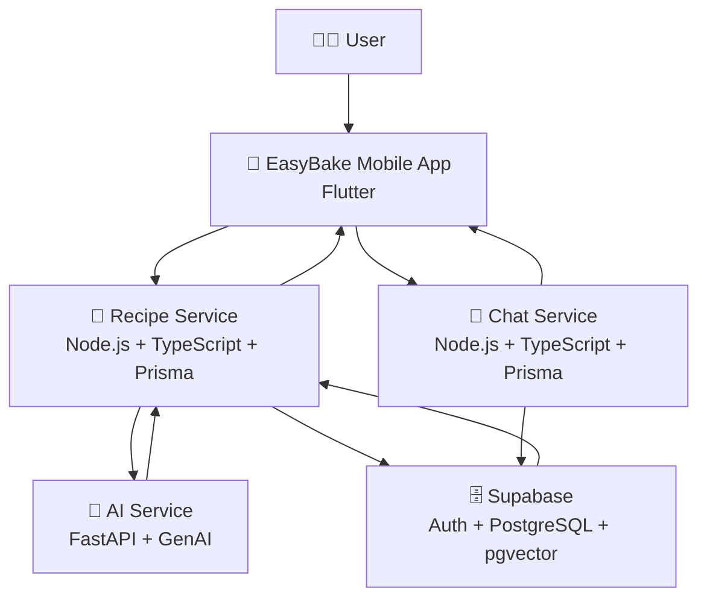

<p align="center">
	
</p>

<p align="center">
	<strong>Cook smarter. Bake better.</strong>
</p>

<p align="center">
	Your smart kitchen companion that transforms cravings and ingredients into practical, delicious recipes in seconds.
</p>

<p align="center">
	<table align="center">
		<tr>
			<td align="center" width="150">
				<br/>
				<strong>Flutter</strong><br/>
				<sub>Mobile App</sub>
			</td>
			<td align="center" width="150">
				<br/>
				<strong>FastAPI</strong><br/>
				<sub>AI Service</sub>
			</td>
			<td align="center" width="150">
				<br/>
				<strong>Node.js</strong><br/>
				<sub>Recipe &amp; Chat Services</sub>
			</td>
		</tr>
		<tr>
			<td align="center" width="150">
				<br/>
				<strong>Azure</strong><br/>
				<sub>Cloud Web Apps</sub>
			</td>
			<td align="center" width="150">
				<br/>
				<strong>Supabase</strong><br/>
				<sub>Users &amp; Data</sub>
			</td>
			<td align="center" width="150">
				<br/>
				<strong>Docker</strong><br/>
				<sub>Local Launch</sub>
			</td>
		</tr>
	</table>
</p>

---

## ✨ Why EasyBake?

EasyBake removes the stress from daily cooking by combining:

- 🧠 Intelligent AI assistance for recipe creation and meal guidance.
- 📱 A modern Flutter mobile experience for fast, friendly usage.
- 🧩 Clean microservice architecture for scale and maintainability.
- ⚡ Fast feedback loops for local development with Docker.

## 👨‍🍳 AI Chef Assistant

<p align="center">
	
</p>

Meet **AI Chef Assistant**: your smart kitchen partner designed to make cooking easier, faster, and more creative.

- 🍳 Suggests recipes from the ingredients you already have.
- 🥗 Helps generate healthier alternatives based on your goals.
- 📝 Turns rough meal ideas into structured, step-by-step recipes.
- ⏱️ Adapts suggestions to available time and cooking complexity.

### 🤖 ADK Multi-Agent Architecture

EasyBake's AI orchestrator leverages the **Google ADK (Agent Development Kit)** to run a sophisticated multi-agent system in `services/ai-service`:



* **Root Router (`root_router_agent`)**: Analyzes conversation history and current user intent to coordinate and delegate tasks to the appropriate specialist agent.
* **Recipe Specialist (`recipe_specialist_agent`)**: Generates structured, step-by-step recipes and queries the database for matching recipes.
* **Shopping List Specialist (`shopping_list_specialist_agent`)**: Handles adding individual ingredients or full recipes directly to the user's active shopping list.
* **Kitchen Assistant (`kitchen_assistant_agent`)**: Answers general culinary questions, provides advice, and suggests ingredient substitutions (swaps).

Conversations are managed inside user-isolated sessions (`community-chat-${userId}` in the community chat, and unique dynamic session IDs in the private chef chat), preserving context and variable states (such as authentication tokens and recipe contexts) throughout the interaction.

## 🧱 Product Modules

EasyBake is a full-stack platform composed of one mobile app and three backend services:

Current capabilities include community chat and recipe creation from images, alongside the core recipe and AI orchestration flows.

| Module | Purpose | Stack |
| --- | --- | --- |
| `apps/easy_bake_mobile` | User-facing app experience (Android, iOS, web, desktop) | Flutter, Dart |
| `services/recipe-service` | Recipe orchestration and business API layer | Node.js, TypeScript, Express, Prisma |
| `services/ai-service` | AI generation and assistant intelligence | Python, FastAPI, Google GenAI |
| `services/chat-service` | Community chat, direct messaging, and chat room orchestration | Node.js, TypeScript, Express, Prisma |
| `Supabase` | User management, relational data, and vector-powered retrieval | Supabase Auth, PostgreSQL, pgvector |

## 🗄️ Supabase Data Layer

EasyBake uses **Supabase** as the core data platform:

- 👤 **Users**: account and authentication flows are managed via Supabase.
- 🗄️ **Relational DB**: structured app data is stored in PostgreSQL tables with relations.
- 🔎 **Vector DB**: embeddings can be stored and queried with `pgvector` for semantic use cases.

## 🏗️ Architecture



### 🔄 Request Flow (High Level)

```text
1) User submits a cooking request in the mobile app.
2) Recipe Service validates and orchestrates the request.
3) AI Service generates structured culinary intelligence.
4) Recipe Service returns clean response data to the app.
5) User receives actionable recipes and guidance.
```

## 🛠️ Tech Stack

- Frontend: Flutter, Dart
- Recipe API: Node.js, Express, TypeScript, Prisma
- AI API: Python, FastAPI, Google GenAI integration
- Data Platform: Supabase Auth, PostgreSQL (relational), pgvector (vector DB)
- Hosting: Azure Cloud Web Apps
- DevOps: Dockerized local launch scripts

## 💻 Programming Languages

<p align="center">
	<table align="center">
		<tr>
			<td align="center" width="170">
				<br/>
				<strong>Dart</strong><br/>
				<sub>Mobile app</sub>
			</td>
			<td align="center" width="170">
				<br/>
				<strong>Python</strong><br/>
				<sub>AI service</sub>
			</td>
			<td align="center" width="170">
				<br/>
				<strong>TypeScript</strong><br/>
				<sub>Backend services</sub>
			</td>
		</tr>
	</table>
</p>

## 🚧 Coming Soon

### Kitchen Dashboard

The current recipes home will be replaced by a kitchen dashboard that can navigate to recipes, pantry, shopping list, health auditor, and more.

- 📚 Centralize the most important cooking workflows in one home screen.
- 🧺 Surface pantry and shopping list actions faster.
- 🩺 Make health and nutrition checks easier to access.

### Private Chat Rooms

Create chat rooms with specific users for focused cooking discussions.

- 🔒 Start one-to-one or small-group conversations.
- 🧑‍🍳 Coordinate recipe ideas and meal planning with selected people.
- 💬 Keep community-wide chat and private chat separate.

## 🚀 Quick Start

### 1. Prerequisites

- Docker Desktop or Docker Engine
- Flutter SDK
- Node.js (for local service development)
- Python 3.10+ (for local AI service development)

### 2. Run Locally (Recommended)

Use the script in the `dev` folder to build and start the containerized services, then launch the Flutter app:

- Local containers + app: `dev/run_local.ps1`
- Cloud-backed app session: `dev/run_cloud.ps1`

`run_local.ps1` starts the containerized services and then runs the Flutter app with local API endpoints. `run_cloud.ps1` launches the Flutter app against the cloud environment while still passing the shared app secret.

### 3. Run Mobile App Manually

If you prefer to start the app without the helper script:

```bash
cd apps/easy_bake_mobile
flutter pub get
flutter run
```

## 🌐 Service Ports

- AI Service: `http://localhost:8000`
- Recipe Service: `http://localhost:4000`
- Chat Service: `http://localhost:4001`

## 🧪 Development Notes

- Environment variables are loaded from service-level `.env` files.
- `GEMINI_API_KEY` must be configured in `services/ai-service/.env`.
- `INTERNAL_APP_SECRET` must be configured in `services/recipe-service/.env`.
- The local launcher starts the backend containers before opening the Flutter app.
- The mobile app is designed to consume the backend APIs as the single source of recipe intelligence.

## 📁 Repository Structure

```text
📦 EasyBake
├─ 📄 README.md
├─ 🐳 docker-compose.yml
├─ 📱 apps
│  └─ easy_bake_mobile
│     ├─ lib
│     ├─ assets
│     ├─ android / ios / web
│     └─ pubspec.yaml
├─ 🧰 dev
│  ├─ run_cloud.ps1
│  └─ run_local.ps1
├─ 🧠 services
│  ├─ ai-service
│  │  ├─ app
│  │  │  ├─ agents      <-- Google ADK multi-agent configurations
│  │  │  ├─ api         <-- FastAPI route endpoints
│  │  │  ├─ core        <-- Logging and configuration
│  │  │  ├─ schemas     <-- Data validation request models
│  │  │  ├─ services    <-- Agent/LLM orchestrator engines
│  │  │  └─ utils       <-- Helper functions and tools
│  │  ├─ tests
│  │  └─ requirements.txt
│  ├─ chat-service
│  │  ├─ src
│  │  ├─ prisma
│  │  └─ package.json
│  └─ recipe-service
│     ├─ src
│     ├─ prisma
│     └─ package.json
└─ ⚙️ scripts
   ├─ windows
   └─ linux
```

## 🎯 Vision

EasyBake is built to become more than a recipe app.

It is a kitchen companion where AI helps users move from uncertainty to confidence, from ingredients to meals, and from routine cooking to joyful food experiences.

<p align="center">
	<b>EasyBake</b><br/>
	<i>Where smart technology meets everyday cooking.</i><br/>
	<sub>Made with love by Gal Helner 💛 🍞</sub>
</p>
